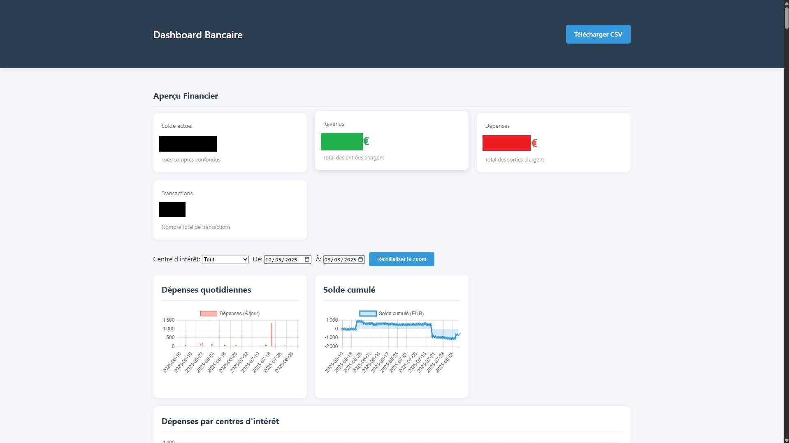

## Powens Banking Dashboard (Flask)

An opinionated Flask application that connects to Powens (ex-Budgea) to fetch multi-bank account transactions and display an interactive personal finance dashboard. It provides server-side CSV export, rich charts (daily expenses, cumulative balance, spend by interest centers), and monthly KPIs.



Note: Add a real screenshot at `docs/screenshot.png` after launching the app (see Capture a screenshot below).

---

### Features

- Real OAuth-like connect flow using Powens Webview
- Automatic handling of connection_id and token init
- Robust transaction fetching with pagination and several API fallback endpoints/params
- User-selectable date window (via query params) or "full history" mode
- Pandas-based post-processing, enriched with account metadata
- KPIs: balance, total income/expenses, 3-month monthly breakdown
- Charts (Chart.js + zoom/pan):
  - Daily expenses (bar)
  - Cumulative balance (line)
  - Expenses by interest centers (multi-line) + pie breakdown
- Server-side CSV export via a short-lived temp file

---

### Project structure

```
cb2004lcl/
  main.py                # Flask app and Powens integration
  templates/index.html   # Dashboard UI, charts, table, controls
  static/style.css       # (optional) global styles
  future.md              # notes
  README.md              # this file
```

You can place screenshots in `docs/` (create the folder if it does not exist).

---

### Requirements

- Python 3.9+ (tested with 3.10+)
- pip

Windows users: running under WSL2 is recommended. macOS/Linux work natively. The app uses HTTPS locally with a self-signed certificate (Werkzeug `ssl_context="adhoc"`).

---

### Installation

1) Clone and enter the project directory:

```
git clone <your-repo-url> cb2004lcl
cd cb2004lcl
```

2) Create a virtual environment and install dependencies:

```
python -m venv .venv
.\.venv\Scripts\activate  # Windows PowerShell
# source .venv/bin/activate # macOS/Linux/WSL
pip install flask requests pandas
```

3) Minimal configuration in `main.py`:

- Update these constants to your sandbox/live credentials and domain:
  - `CLIENT_ID`
  - `CLIENT_SECRET`
  - `DOMAIN` (e.g. `cb2004lcl-sandbox.biapi.pro`)
  - `REDIRECT_URI` (defaults to `https://localhost:5000/callback`)

- Optionally set a stable session key (recommended):

```
$env:FLASK_SECRET_KEY = "your-long-random-secret"   # Windows PowerShell
export FLASK_SECRET_KEY="your-long-random-secret"   # macOS/Linux/WSL
```

Important:

- Ensure the redirect URI is registered in your Powens configuration and exactly matches `REDIRECT_URI`.
- The app sets `SESSION_COOKIE_SECURE=True` and serves HTTPS locally; access the app via `https://localhost:5000` to keep the session cookie.
- With the self-signed certificate you may have to click through a browser warning once.

---

### Running the app

```
python main.py
```

Then open `https://localhost:5000` in your browser. You will be redirected to the Powens Webview to connect accounts. After you are redirected back to `/callback`, the app fetches accounts and transactions, computes metrics, and renders the dashboard.

---

### Usage

- Optional query parameters at `/` to control the fetched period:
  - `start_date=YYYY-MM-DD`
  - `end_date=YYYY-MM-DD`
  - `full_history=true|false` (if true and no user dates: fetch without date upper bound)

Examples:

```
https://localhost:5000/?start_date=2024-01-01&end_date=2024-12-31
https://localhost:5000/?full_history=true
```

In the UI you can also change the visible date range using the date pickers; charts support zoom and pan (mouse wheel + drag). Use the "Reset zoom" button to restore.

To export the displayed dataset as CSV: click "Télécharger CSV" (Download CSV). The server writes a temporary file and deletes it automatically after download.

---

### What the app does (flow)

1. Initialize a user token via `POST /2.0/auth/init`.
2. Get a temporary code via `GET /2.0/auth/token/code`.
3. Redirect to Powens Webview (`/connect`) with `domain`, `client_id`, `redirect_uri`, and `code`.
4. On `/callback`, store `connection_id` and ensure a valid session token.
5. Fetch accounts from `GET /2.0/users/me/accounts`.
6. For each account, fetch transactions with pagination and several fallback endpoints/param shapes (date filters or full-history heuristics).
7. Flatten/enrich transactions into a Pandas DataFrame, compute KPIs and chart series.
8. Render `templates/index.html` (Chart.js frontend) and provide a server-side CSV download.

---

### Data model (exported columns)

The app attempts to preserve Powens transaction fields and exposes a subset when present:

- `id`, `id_account`, `account_name`
- `application_date`, `date`
- `value` (and derived `amount`), `original_value`, `original_currency`
- `type`, `original_wording`, `simplified_wording`, `wording`
- `categories`, `comment`

Derived fields for charts:

- Daily expenses (sum of negative amounts per day)
- Cumulative balance (cumulative sum across dates)
- Interest centers (keyword-based heuristic over wording/category)

Note: Column presence depends on the upstream API payload.

---

### Capture a screenshot

1. Run the app and complete the Powens connect flow.
2. Once the dashboard loads with charts, take a screenshot of the whole page.
3. Save it as `docs/screenshot.png` so the image appears at the top of this README.

---

### Configuration notes & security

- Do not commit real `CLIENT_SECRET` to version control. Consider loading `CLIENT_ID`/`CLIENT_SECRET` from environment variables and reading them in `main.py`.
- Keep `FLASK_SECRET_KEY` set to a strong value in production.
- If you deploy behind a reverse proxy/SSL terminator, remove the `ssl_context="adhoc"` in `app.run(...)` and configure TLS at the proxy level.
- Respect API rate limits; the app prints debug logs to help diagnose API responses and pagination.

---

### Troubleshooting

- Browser shows a certificate warning: this is expected with the local self-signed cert. Proceed once to trust it for localhost.
- "Missing connection_id" on `/callback`: do not navigate directly; always start from `/` to go through the Webview first.
- Empty transactions: use a longer period, or `full_history=true`. The app also tries alternative endpoints/params and can refresh the connection automatically.
- Session seems lost after redirect: ensure you are on `https://` (not `http://`) and the domain is exactly `localhost` due to `SESSION_COOKIE_SECURE=True`.

---

### Roadmap ideas

- Move secrets to environment variables by default
- Add `requirements.txt` and Dockerfile for reproducible runs
- Add tests and CI
- Add category editor and custom rules in the UI

---

### License

Choose a license (e.g., MIT) and add a `LICENSE` file if you plan to distribute this project.


